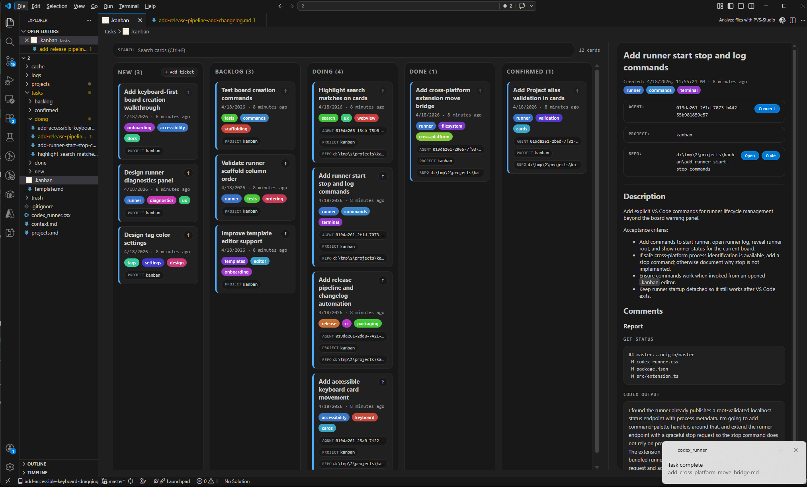

# ai-kanban

[](https://marketplace.visualstudio.com/items?itemName=flcl42.kanban-vsix)

ai-kanban is a VS Code Kanban board backed by normal folders and Markdown files. It works as a simple local task board by default, and it can optionally run a background Codex runner for AI-assisted task execution.

## Preview



## Install

Install from the Visual Studio Marketplace:

1. Open VS Code.
2. Open Extensions.
3. Search for `ai-kanban` or `flcl42.kanban-vsix`.
4. Install the extension.

Install from a local VSIX:

```powershell
code --install-extension .\kanban-vsix-<version>.vsix
```

After installation, open the Command Palette with `Ctrl+Shift+P` or `Cmd+Shift+P` and search for `AI Kanban`.

## Create A Board

ai-kanban stores board state in a `.kanban` YAML file. Columns are folders beside that file, and cards are Markdown files inside column folders.

Use one of these commands:

- `AI Kanban: Create Empty Board` creates only a `.kanban` file in the folder you choose.
- `AI Kanban: Create Board with Columns` creates `.kanban` plus the default workflow folders: `new`, `backlog`, `doing`, `done`, `confirmed`.
- `AI Kanban: Create Board with Initialized Runner` creates `tasks/.kanban`, the default workflow folders, and a local `codex_runner.csx` script beside the board.

You can also create a `.kanban` file manually and open it in VS Code. If a `template.md` file exists beside `.kanban`, new tickets use it as the card template.

## Use The Board

Each card is a Markdown file. The first `# Heading` becomes the card title. Plain `Key: Value` lines under the title become task properties in the details panel.

Useful board actions:

- Press `Ctrl+F` or `Cmd+F` in the board to search cards by title, body, tags, file name, and properties.
- Drag cards between columns or within a column to reorder them.
- Use the bump button on a card to move it to the top of its column.
- Use property actions in the details panel to open local paths, URLs, repositories, or VS Code windows.

The `.kanban` file is YAML. The optional `folders` section controls column order and display names:

```yaml
folders:
  new: new
  backlog: backlog
  doing: doing
  done: done
  confirmed: confirmed
```

## Optional Codex Runner

The runner is optional. If you never start it, ai-kanban remains a normal Markdown-and-folder Kanban board.

The runner watches `tasks/backlog`, starts Codex on cards, moves active cards to `doing`, and moves completed or blocked work to the matching workflow folders. It keeps running in the background after VS Code closes.

To use it:

1. Run `AI Kanban: Create Board with Initialized Runner`, or open an existing board and click `Initialize runner` in the warning panel.
2. Install the required tools if the panel reports them missing.
3. Click `Start runner` in the board warning panel.

Runner prerequisites:

- .NET SDK.
- `dotnet-script` global tool, installable with `dotnet tool install -g dotnet-script`.
- Codex CLI available as `codex`.

You can hide runner warnings from the panel if you want a board-only workflow. The setting is `kanban.runnerPanel.enabled`.

## Runner Task Format

Runner cards use normal Markdown plus a few properties:

```md
# Example task

Project: blank
Agent:
Repo:

## Description
Describe the work here.

## Comments
```

`Project:` can name a repository alias from `projects.md`. Use `Project: blank` or `Project: -` when the task should use a temporary empty workspace instead of a repository.

`Agent:` and `Repo:` are managed by the runner. Leave them present when you want Codex sessions and repository state to resume cleanly.

## Settings

- `kanban.detailsPaneWidth` controls the saved details pane width.
- `kanban.runnerPanel.enabled` shows or hides the optional runner warning panel.
- `kanban.runner.command` controls the command used to start the runner.
- `kanban.runner.args` controls runner startup arguments and supports `${runnerScript}`, `${runnerRoot}`, `${kanbanDir}`, and `${workspaceFolder}`.

## Development

Install dependencies and build:

```powershell
npm install
npm run compile
```

Package a VSIX:

```powershell
npm run package:vsix
```
